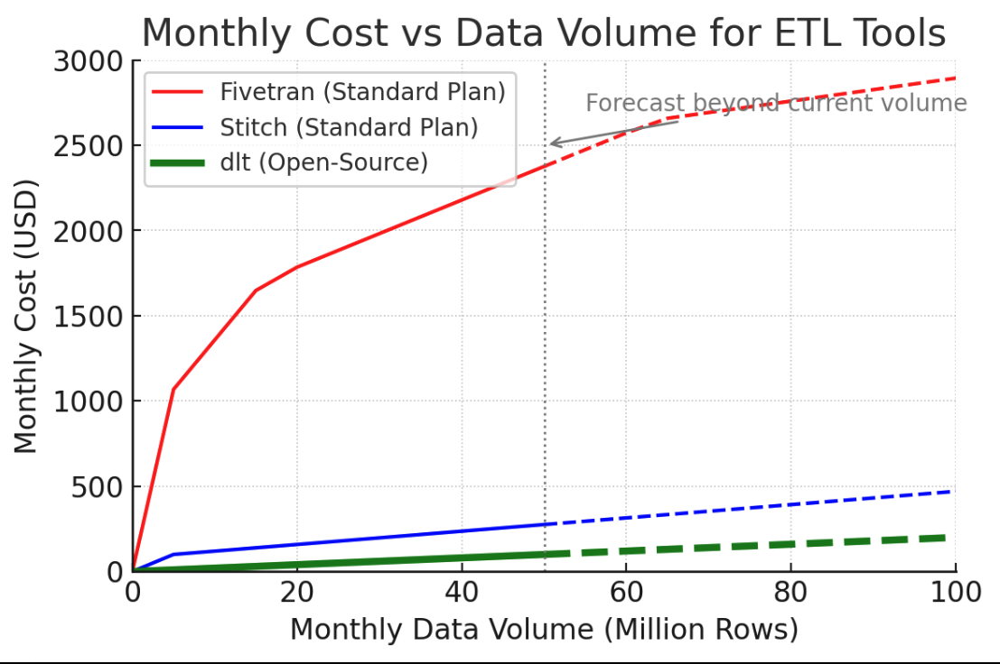

<center>
“Shipping beats perfection. Especially in pipelines.”

— Modern Data Stack Wisdom
</center>


# Step 2: Five-Minute First Pipeline

Point-and-click ETL platforms like Fivetran or Stitch promise quick wins – connect a source and you’re done – but under the hood there’s a catch. Convenience often comes with trade-offs: mounting costs, rigid pre-defined schemas, and loss of control over your data flow. What starts as a shortcut can turn into a shackle on your team’s agility.

Now picture something different.  A tool that speaks your language — whether that's Python or even plain English with AI help — that runs anywhere, and that you 
can understand, debug, and evolve. With *dlt*, that’s exactly what you get: a code-first, open-source pipeline framework that empowers you to go from idea to working pipeline in minutes—without the vendor lock-in or sky-high SaaS bills. And yes, vibe coding your very first pipeline is not only recommended — it's strongly advised.

We’re not talking theory. Companies that replaced managed ETL tools with dlt have reported 20x to 200x lower costs, while gaining better transparency, observability, and control [1](https://dlthub.com/blog/fivetran-vs-dlt). In one real case, a team slashed their data ingestion cost by 10,000x just by switching to a lightweight dlt script.



And the kicker? With modern tooling—and a little help from AI—getting started with dlt can be almost as fast as clicking a "connect" button. 
Except this time, you own the pipeline — and by extension, you own the data. You control where it comes from, how it's handled, where it's stored, and how it evolves. No more guessing what a third-party tool is doing behind the scenes.

> *Note: If you just read Chapter 1, some of this may sound familiar. That’s by design. Not everyone will read this book linearly, 
> and for some readers, Chapter 2 is their entry point. A brief reminder of why dlt exists sets the stage for the hands-on work ahead.*

In this chapter, we won’t just make the case. We'll guide you through your first win. Whether you want to start with a small prototype or jump straight into building something real, there's a fast path for you. Especially, thanks to dlt’s design, even a hand-written connector is far easier than building one from scratch – ‘you write standard Python, and dlt handles schema evolution...weeks to get right 

**You *could* build a pipeline in just a few minutes.** In fact, dlt is designed so that you can go from a REST API to a database in around **5 minutes** of work. dlt automates away much of the tedious boilerplate (handling auth, pagination, schema inference, etc.), letting you focus on what data you want rather than how to fetch and load it. *But realistically, your use case might be more complex* than a toy example, so dlt provides multiple paths to get started. Below we outline several options – from the simplest plug-and-play pipeline to more customized builds – along with the estimated time each approach might take. Choose the path that fits your needs and skill level:

* **Option 1: Use an Existing Verified Pipeline (≈3 minutes).** The fastest route is to leverage dlt’s library of pre-built *verified sources* (connectors). These are ready-made pipeline scripts for popular data sources, developed and tested by the community. You can initialize one with a single command. For example, running `dlt init pipedrive bigquery` will scaffold a complete pipeline project to extract data from the Pipedrive API and load it into BigQuery. The template code (downloaded to your project) includes everything needed – you typically just add your credentials to the config and run the pipeline. Using verified source pipelines gives you **instant gratification** similar to Fivetran's one-click connectors, but you also get the Python source code for full transparency and customization. *Resources:* The dlt docs provide a catalog of verified sources and how to use the `dlt init` command [2](https://dlthub.com/docs/walkthroughs/add-a-verified-source)  .

* **Option 2: Build a Minimalistic Loading Pipeline (≈3 minutes).** If you have a simple one-off data source (like a local file, DataFrame, or JSON output) and just want to load it quickly into a destination, dlt makes that trivial as well. In just a few lines of Python, you can create a pipeline and call `pipeline.run(data_object)` to load it. For example, to load a Pandas DataFrame to a Snowflake table, you can do:

  ```python
  import dlt, pandas as pd
  df = pd.DataFrame([...])  # your data here
  pipeline = dlt.pipeline(pipeline_name="quick_load", destination="snowflake")
  pipeline.run(df, table_name="my_table")
  ```

  Under the hood, dlt will automatically translate the DataFrame (or Arrow table, JSON, etc.) into the proper format, infer the schema, and load it to the warehouse. This approach is great for prototyping or ingesting static datasets with minimal effort. *Resources:* See the dlt documentation on loading Arrow/Pandas objects for examples of quickly ingesting in-memory data. There are also community notebooks and Colab demos illustrating simple file-to-database pipelines [3](https://dlthub.com/docs/dlt-ecosystem/verified-sources/arrow-pandas).

* **Option 3: Build a Full Extract & Load Pipeline, Imperative Style (≈1 hour).** For more complex or custom scenarios, you can write your own pipeline code using dlt’s primitives. This is an **imperative approach** where you explicitly code how to call an API or query a source and yield data records, while dlt handles the heavy lifting of loading, schema management, retry logic, etc.. You might define a Python generator function to page through an API and decorate it with `@dlt.resource`, then use `pipeline.run()` to extract and load. This approach gives you *full flexibility*: you can implement custom transformations, complex authentication flows, or any logic needed for your data. The trade-off is more upfront coding (hence \~1 hour estimate for a non-trivial API). However, thanks to dlt’s design, even a hand-written connector is far easier than building one from scratch – *“you write standard Python, and dlt handles schema evolution, state management, incremental loading, parallelism, retries and all the production complexity that usually takes weeks to get right”*. In other words, you get to focus on your data logic, and dlt takes care of the boring but important infrastructure. *Resources:* To get started, follow the official quickstart guide or walkthrough in the docs, which shows how to write a pipeline (for example, pulling issues from the GitHub API). There are also workshop videos and courses (e.g. Data Engineering Zoomcamp’s dlt module) that walk through building a connector step by step. These resources explain concepts like normalization, state, and error handling in dlt – useful when you’re building a robust pipeline from scratch [4](https://dlthub.com/docs/walkthroughs/create-a-pipeline)  . 

* **Option 4: Build a REST API Pipeline, Declarative Style (≈2 hours).** If you need to integrate with a RESTful API but want to minimize coding, dlt offers a powerful *declarative* option. The **REST API source** is a generic connector that lets you describe the API **in a simple configuration (a Python dict)** instead of writing all the request logic yourself. You specify the endpoints to hit, any nested relationships between endpoints (for example, a parent endpoint and a child sub-endpoint), how to handle pagination, and the auth method – *all as configuration*. dlt then takes care of calling the API, retrieving and un-nesting the data, and loading it into tables, all according to that config. This “low-code” approach can dramatically speed up development for APIs: you get the flexibility of code (since the config is just Python, you can even add slight logic if needed) but without having to write the boilerplate of requests, loops, etc.. In practice, setting up a non-trivial API with several endpoints declaratively might take a couple of hours as you map out the endpoints and test incrementally. The payoff is maintainability – the pipeline config is very concise and easy to adjust. *Resources:* The **Untitled Data Company** has an excellent tutorial series on using dlt’s REST API source (with example pipelines for GitHub, Zoom, and even a Pokémon API). These cover topics like setting up parent-child endpoint relations, handling auth tokens, and enabling incremental loading. The official dlt documentation on the REST API source is also a must-read – it explains how to configure endpoints and includes advanced tips (like custom response handling and error ignores) if your API is quirky [5](https://dlthub.com/docs/dlt-ecosystem/verified-sources/rest_api), [6](https://github.com/untitled-data-company/dlt-rest-api-tutorial).

* **Option 5: *“Vibe-code”* a REST Pipeline with AI Assistance (≈10 minutes).** Finally, one of the most exciting ways to build a pipeline quickly is to leverage automation and AI. dlt recently introduced a pipeline generator tool (`dlt-init-openapi`) that can create a **custom API pipeline instantly from an OpenAPI specification**. Essentially, if the service you want to integrate has a published OpenAPI (Swagger) doc, you can point the dlt generator to that spec and it will auto-generate a ready-to-run pipeline for you – including all the endpoints and authentication setup. In internal tests, this tool was able to produce working pipelines for many APIs with minimal human effort. It’s not using an LLM (so the output is deterministic) but it massively accelerates the **“time from intention to data in DB”** – which, as dlt’s team emphasizes, is a key metric (they’ve seen users go from zero to a filled database in 5 minutes). Even without an OpenAPI spec, you can still speed up coding by using AI pair-programming assistants (the dlt team often uses tools like **Cursor** or GitHub Copilot – *“writing Python is faster than ever”* with these). This approach, informally called **“vibe coding,”** means you let the AI handle the repetitive parts while you steer the high-level logic. In about 10 minutes of interactive coding, you can have a basic pipeline script fleshed out by AI and then tweak it to perfection. *Resources:* Check out dlt’s blog for a Colab notebook demo that builds a pipeline in under 5 minutes using the OpenAPI generator (loading Stripe API data into DuckDB). The `dlt-init-openapi` announcement post is also a great read – it explains how the generator works and how you can try it on any API with an OpenAPI spec. And if you’re curious about AI-assisted coding, dlt’s philosophy piece on *“Fivetran vs dlt”* discusses how modern data engineers can harness coding tools and AI to iterate faster than ever [7](https://dlthub.com/blog/openapi-pipeline), [8](https://colab.research.google.com/drive/1MRZvguOTZj1MlkEGzjiso8lQ_wr1MJRI?usp=sharing), [9](https://github.com/dlt-hub/dlt-init-openapi).

**Definition of Done:** By the end of this step, you should have seen a simple data pipeline running – whether it’s a quick demo loading some data to your warehouse or a prototype connector for an API. In a live setting, we’d now do a short demo (perhaps a “vibe-coded” session) to show how, for example, we can connect to a sample API and load data into a destination within minutes. This demonstration proves that *you don’t need weeks of development or expensive SaaS tools to get data flowing*. You have multiple pathways to success with dlt, so even if your real project is more complex, you’ve learned that getting an initial pipeline is both fast and feasible. From here, you can proceed to refine and expand your pipeline, confident that you’ve replaced the likes of Fivetran/Stitch with an efficient, flexible solution of your own making.

**Next Steps:** Depending on which option you chose, you can now either dive deeper into customizing your pipeline or explore deploying it to production. In the upcoming chapters, we’ll cover how to productionize your dlt pipelines, handle transformations, and ensure everything runs reliably. Keep in mind that what we achieved in minutes here is just the beginning – you now have the foundation to build on and adapt to your exact needs, without vendor lock-in or exorbitant costs.

 

