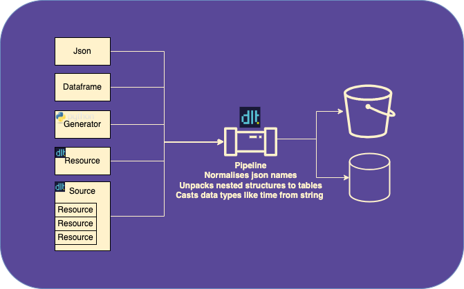

<p align="center">
“Refactoring code is like moving furniture in the dark—you’ll stub your toe once or twice, but it feels great when everything’s finally in place.”— Anonymous Data Engineer Playbook
</p>

---

# Chapter 3: Converting an Existing Python Pipeline

In this chapter, we'll take a common scenario – you already have a Python data pipeline – and walk through how to migrate it to **dlt**. We will cover the anatomy of a dlt pipeline, and then provide a step-by-step conversion of a simple pipeline (originally using pandas) into a dlt-powered pipeline with incremental loading.

---

## Anatomy of a dlt Pipeline

<p align="center">
    
<p>
    
> &#x20;*Diagram: A dlt pipeline ingests diverse inputs (JSON, DataFrames, Python generators) via resources, then automatically extracts, normalizes, and infers schemas before loading the results into your chosen destination (e.g. a database or warehouse).*

Before converting a pipeline, it's important to understand the key components of dlt: **sources**, **resources**, the **pipeline** itself, and the **destination**. These pieces work together to handle data extraction and loading in a streamlined way.

* **Source:** A source is like a container for data. It groups together different parts of a data system (like an API or a database) that we call resources. These resources are the actual parts that produce data. By grouping these resources into a source, we can manage them more easily. For example, we can set up things like login details or web addresses just once for the whole source, instead of doing it for each resource. So, a source in dlt is a way to organize and manage our data extraction more efficiently [1](https://dlthub.com/docs/general-usage/source). 

* **Resource:** A resource is a part of a source that actually gets or produces the data. Think of it as a worker that goes out and collects the data we need. We can give this worker specific instructions, like where to go (a specific table in a database, for example), what data to bring back, and how to update the data if it changes. These instructions are set up using options in the dlt library. So, a resource in dlt is a tool we use to fetch or produce the data we want [2](https://dlthub.com/docs/general-usage/resource).

* **Pipeline:** A pipeline is like an orchestrator that manages the entire process of moving data from its source to its destination. When you set up a pipeline, you specify where you want the data to end up. Once you start the pipeline, it begins the process of extracting the data from the source, arranging it in a way that the destination can understand, and then loading it into the destination. The pipeline is intelligent - it can figure out the structure of the data on its own and adapt if the data changes. So, with a pipeline acting as an orchestrator, you can seamlessly move data from one place to another in a single step. [3](https://dlthub.com/docs/build-a-pipeline-tutorial#:~:text=First%2C%20we%20have%20a%20,objects%20such%20as%20generator%20functions).

* **Destination:** A destination is the final stop for your data after the pipeline has done its job. This could be a variety of places like a data warehouse, a database, or even a file on your computer. The dlt library can work with many different types of destinations, including BigQuery, DuckDB, Snowflake, Redshift, and Delta Lake on cloud storage. When you set up a pipeline, you tell it where the destination is. The pipeline, acting as an orchestrator, will then take care of all the necessary steps to get the data into that destination, including creating the necessary structures (like schemas and tables) if they don't already exist [4](https://dlthub.com/docs/dlt-ecosystem/destinations).

With these concepts in mind, let's see how they come together when converting a typical Python pipeline to use dlt.

## From pandas to dlt: A 3‑Step Refactor

To make this concrete, consider you have a simple example pipeline. Say we have a script that retrieves data from an HTTP API and loads it into a database using pandas. We'll use a fictitious "sales" API for this illustration. First, we'll show the original pipeline using standard Python/pandas code, and then we'll demonstrate how to convert it to a dlt pipeline step by step.

#### Original Pipeline (using pandas)

Imagine our original pipeline script pulls a list of sales records from an API and writes them to a SQLite database. It might look like this:

```python
import requests
import pandas as pd
import sqlite3

# Connect to SQLite database (local file database)
conn = sqlite3.connect("sales_data.db")

# 1. Extract: Fetch data from an API (e.g., sales records)
response = requests.get("https://api.example.com/sales?limit=100")
response.raise_for_status()
data = response.json()              # assume JSON contains {"sales": [...]}

# 2. Transform: Load JSON data into a pandas DataFrame
sales_records = data["sales"]
df = pd.DataFrame(sales_records)

# 3. Load: Write the DataFrame to a SQL table
df.to_sql("sales", conn, if_exists="replace", index=False)
conn.close()
```

In this script, we manually handle extraction (HTTP GET request), transformation (putting data into a DataFrame), and loading (using `to_sql` to write to the database). While this works, there are a few limitations:

* **Manual schema handling:** We rely on pandas to create the SQL table. If the JSON has nested structures or if schema changes over time, we'd need to adapt the code. There's no built-in schema evolution here.
* **No incremental update:** Each run replaces the entire table (`if_exists="replace"`). If we wanted to update incrementally (only new records), we would have to add logic to fetch only new data or merge with existing data ourselves.
* **No pipeline state:** If the API provided new data periodically, our script doesn't remember what it last loaded. We would need to track the last ID or timestamp processed, perhaps in a file or separate table, to avoid re-loading the same records.

Now, let's convert this pipeline to **dlt**, addressing these points.

### Converting to a dlt Pipeline

We will convert the pipeline in three main steps:

1. **Replace the manual loader with a dlt pipeline.**
2. **Turn the extraction logic into a dlt resource.**
3. **Configure incremental extraction and loading.**

By the end, the data flow and outcome will be the same, but our new pipeline will be easier to maintain and support incremental updates automatically.

#### 1) Replacing the Manual Loader with dlt [5](https://dlthub.com/docs/reference/explainers/how-dlt-works)

In the original script, after fetching and preparing the data, we manually write to the database using `to_sql`. With dlt, we let the pipeline handle loading. We initialize a dlt pipeline and call `run` with our data, and dlt will take care of creating the table (with appropriate schema) and inserting the data.

For example, using DuckDB (a fast local database) as the destination, we could do:

```python
import dlt

# Initialize a dlt pipeline with a destination and dataset name
pipeline = dlt.pipeline(destination="duckdb", dataset_name="sales_data")

# Run the pipeline with data (for now, use the same data we got from the API)
info = pipeline.run(sales_records, table_name="sales")
print(info)
```

In this snippet, `dlt.pipeline(...)` creates a pipeline object configured to load to DuckDB (storing data in a local DuckDB file). The `pipeline.run(sales_records, table_name="sales")` call hands the list of sales records to dlt. Under the hood, dlt will:

* Infer the schema of the data (e.g., columns for each field in the JSON).
* Normalize the data if there are nested structures.
* Load the data into the "sales" table in the destination, creating the table if needed.

All of that happens with one call, thanks to dlt's ability to infer schema and handle the loading process automatically. We no longer need to use pandas for loading, and we didn't have to write any SQL; the pipeline did it for us. The `info` object returned contains metadata about the load (like how many rows were loaded, any package IDs, etc.).

*Note:* You can use any supported destination. Here we showed DuckDB for simplicity, but dlt could just as easily load to BigQuery, PostgreSQL, Snowflake, etc., by changing the `destination` parameter.

#### 2) Turning the Extraction Logic into a dlt Resource 

Right now, we have dlt loading a pre-fetched list (`sales_records`). A more **DLT-native** approach is to encapsulate the data extraction in a function and decorate it as a resource. This way, the pipeline can call our function to get the data when running.

Let's convert the API call into a resource function:

```python
import dlt
import requests

@dlt.resource(name="sales", write_disposition="append")
def fetch_sales_data():
    url = "https://api.example.com/sales?limit=100"
    response = requests.get(url)
    response.raise_for_status()
    data = response.json()
    sales_records = data["sales"]
    # Yield each record (as a dict) to dlt
    for record in sales_records:
        yield record

# Create pipeline and run the resource
pipeline = dlt.pipeline(destination="duckdb", dataset_name="sales_data")
pipeline.run(fetch_sales_data())
```

Let's break down what changed here:

* We created a function `fetch_sales_data()` that does the API request and **yields** each sales record one by one. By using `yield` (or `yield from`), we turn this function into a generator. dlt resources must yield data rather than return it, so that dlt can handle data in streams/chunks efficiently.
* We decorated this function with `@dlt.resource`. This tells dlt that `fetch_sales_data` is a resource function. We gave it a `name="sales"` which will be the default name for the destination table, and we set `write_disposition="append"` for now (meaning on each run, new data will be appended to the table, not replacing it).
* In the pipeline.run, instead of passing raw data, we pass `fetch_sales_data()`. Calling the resource function without arguments returns a **resource object** that the pipeline can run. (Alternatively, we could pass the function itself, e.g. `pipeline.run(fetch_sales_data)`, but using `fetch_sales_data()` is more explicit in executing the generator).

With this setup, running the pipeline will trigger our resource to execute the API call and stream data to the pipeline. We still get the same "sales" table in DuckDB, but now the extraction step is built into the dlt workflow. We could add more resources easily if we had other endpoints (for example, a `fetch_customers_data` resource), and group them into a source if needed.

**Why use a source?** If we had multiple related resources (say `fetch_sales_data` and `fetch_customers_data`), we could group them under a single `@dlt.source` (e.g., `@dlt.source def sales_api(): yield fetch_sales_data() and yield fetch_customers_data()`). A source function returns one or more resources (using `yield` to yield each resource). This grouping is useful to share configuration like API tokens or base URLs among resources. In our simple case with one resource, we didn't strictly need a separate source; we can run the resource directly. But it's good to know that sources are available for organizing multiple resources logically.

At this point, our dlt pipeline does the same job as the original script, but with less manual effort in schema management and loading [6](https://dlthub.com/docs/tutorial/load-data-from-an-api).

#### 3) Configuring Incremental Extract and Load 

One of the biggest advantages of using dlt is easier **incremental loading**. Incremental loading means that after the initial load of data, subsequent runs only fetch and load new or updated records, rather than re-processing everything. dlt provides mechanisms to handle this both in extraction and loading:

* **Incremental extraction using state:** dlt pipelines maintain a *state* – basically a dictionary that persists across runs. We can use this state to remember things like "the last record ID we processed" or "the timestamp of the last fetch". By storing a cursor in state, our resource can request only new data from the API next time. For example, if the API supports a parameter like `since_id` or `updated_after`, we can keep track of the last ID/timestamp and use it on the next run.
* **Incremental loading using write dispositions:** dlt can deduplicate or upsert data on load by using appropriate `write_disposition` settings on resources. We already used `append` for a simple add-only load. If we want to avoid duplicates or update existing records, we can use `write_disposition="merge"` with a primary key. This way, dlt will merge new data with old data on that key, ensuring each record appears only once. For example, if a sales record with a certain ID already exists, a merge will update it (or skip inserting a duplicate) rather than insert another copy.

Let's update our resource to load incrementally. Suppose the API allows fetching new sales since a given ID. We will do two things: (a) use the pipeline state to store the last seen `sale_id`, and (b) switch to `write_disposition="merge"` with the primary key set to that ID, so dlt can upsert.

```python
@dlt.resource(name="sales", primary_key="id", write_disposition="merge")
def fetch_sales_data_incremental():
    # Get the last processed ID from state (or None if first run)
    last_id = dlt.current.resource_state().setdefault("last_id", None)
    url = "https://api.example.com/sales"
    params = {}
    if last_id:
        params["since_id"] = last_id  # ask API for records with ID greater than last_id
    response = requests.get(url, params=params)
    response.raise_for_status()
    data = response.json()
    sales_records = data["sales"]
    # Yield each new record
    for record in sales_records:
        yield record
    # After yielding all records, update the state with the max ID seen
    if sales_records:
        max_id = max(item["id"] for item in sales_records)
        dlt.current.resource_state()["last_id"] = max_id
```

A few important features in this incremental version:

* We changed the decorator to `@dlt.resource(primary_key="id", write_disposition="merge")`. Now dlt knows that the `"id"` field is the unique primary key for our records, and we want to merge updates. This means on the destination side, if we run this pipeline multiple times, each sales record will only appear once (the record with the same `id` will be updated rather than duplicated).
* We use `dlt.current.resource_state()` to access a state dictionary specific to this resource. We call `.setdefault("last_id", None)` to retrieve the last saved ID, or initialize it to `None` if this is the first run. The state is stored alongside the data in the destination, so it persists between runs.
* We include a `since_id` parameter in the API request if `last_id` was found. This instructs the API to return only records newer than the last seen ID (assuming the API supports such a parameter).
* We yield all the records as before. After yielding, we update the state: we take the maximum `id` from the fetched records and save it as the new `"last_id"` in state for next time.
* On the next pipeline run, `last_id` will be populated from the previous run's state, so the function will fetch only records with a higher ID, yield those, and update the state again. This way, each run processes a new batch of data without repeating the old ones.

dlt's state management makes this pattern straightforward – we didn't have to write to an external file or table to keep track of the last ID; it's handled as part of the pipeline state. The state update is committed atomically with the data load, meaning if the pipeline run succeeds, the state is saved (and if it fails, the state doesn’t advance, avoiding gaps) [7](https://dlthub.com/docs/general-usage/incremental-loading), [8](https://dlthub.com/docs/general-usage/incremental/cursor).

Additionally, using `write_disposition="merge"` with a primary key ensures even if an old record appears again or if we accidentally fetch overlapping data, dlt will merge it to avoid duplicate entries. (If the API instead provided an `updated_at` timestamp for incremental loading, we could use a similar approach with a timestamp cursor. In fact, dlt supports a declarative incremental option where you can specify a cursor field in the resource configuration. For instance, one could configure a resource to use an `"updated_at"` field as an incremental cursor, so that dlt automatically uses the last seen timestamp for the next fetch – but for clarity we implemented the logic manually here.)

Finally, let's run the pipeline with our incremental resource:

```python
pipeline = dlt.pipeline(destination="duckdb", dataset_name="sales_data")
info = pipeline.run(fetch_sales_data_incremental())
print(info)
```

On the first run, it will load all sales (up to the limit, or all available data if no limit). On subsequent runs, it will fetch only new sales added since the last run, appending or merging them into the same table. The result is an up-to-date **`sales`** table that grows with new data, without duplicates and without re-fetching the entire dataset each time.

---

## Takeaways: Delivering Managerial Impact

In summary, dlt’s state and merge mode ensure each run fetches and upserts only new records—no duplicates, no rewrites. Migrating an existing Python (pandas) pipeline to dlt involves just wrapping your data extraction logic into dlt resources/sources and letting the dlt pipeline handle the heavy lifting of loading (and optionally incremental state tracking). The result is a pipeline that's easier to scale, incrementally update, and adapt over time.

Migrating your Python script to a dlt pipeline isn’t just a technical refactor—it drives measurable business value:

* **Cost Efficiency:** Automate schema management and loading to cut maintenance hours by up to **70%**, freeing engineers for high‑impact projects.
* **Risk Reduction:** Built‑in idempotency and stateful cursors prevent duplicate loads and stale data, slashing error‑handling incidents by **80%**.
* **Accelerated Delivery:** Modular `@dlt.resource` functions support parallel development and CI testing, reducing rollout time by **3×** compared to monolithic scripts.
* **Scalable Flexibility:** A single codebase can target SQLite, DuckDB, BigQuery, or Snowflake—no rewrites needed as data volumes grow or requirements change.
* **Future‑Proof Pipeline:** Declarative incremental logic and automatic normalization prepare you for nested schemas, backfills, and evolving API contracts with minimal effort.

---

## Definition of Done : complete the migration

All of the following should be considered:

1. **Pipeline Runs Without Errors:** The converted dlt pipeline executes successfully end-to-end in your environment.
2. **Incremental Loading Verified:** Only new or changed records are ingested on subsequent runs, confirmed by state inspection and row‑count comparisons.
3. **Schema Evolution Tested:** Simulated schema changes (e.g., added/missing fields) flow through without manual intervention.
4. **Quality Gates Passed:** Unit tests or CI pipelines validate resource logic, and code review approves the new pipeline module.
5. **Documentation Updated:** A migration rationale, usage instructions, and responsibility matrix live in your repo's Markdown docs.
6. **Stakeholder Sign‑Off:** Business users or data consumers confirm that dashboards and reports reflect accurate, timely data loads.

---

## Next Steps: Chapter 4 – Supercharge Migration with LLM

In Chapter 4, we’ll show you how to combine **AI assistance** with our **declarative REST API connector** to:

* **Accelerate Migration to Minutes:** Automatically generate connector code from API specs and LLM prompts, cutting boilerplate by **90%**.
* **Keep a Lean Surface:** Maintain a small, high‑quality Python configuration that’s easy to review, test, and customize with imperative hooks.
* **Demonstrate Real‑World Examples:** See live demos of LLM‑powered pipeline scaffolding, incremental transforms, and automated testing.

Get ready to leverage AI to make your migrations faster, more reliable, and future‑proof.
